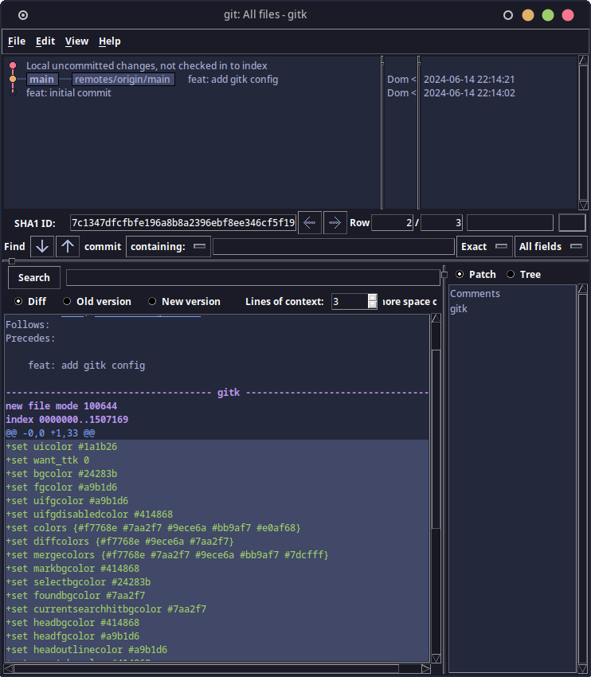

# Tokyonight for [gitk](https://git-scm.com/docs/gitk)

> A dark theme for [gitk](https://git-scm.com/docs/gitk).



## Install with git

```bash
git clone https://github.com/domwalters/gitk-tokyonight "$HOME/.config/git"
```

## Issues

`gitk` is quite an old piece of software. As such, it doesn't expose all the
customisation options needed to get the theme fully aligned with other
implementations of tokyonight.

Notably:

- [The foreground and background colours of text that has been matched using the
  search feature cannot be changed.](https://github.com/dracula/gitk/issues/14)
    - This can result in the text being quite hard to read.
- Panel outlines cannot be changed from the default light grey.

## Troubleshooting

- If you encounter issues with the responsiveness of the UI, the colours of the
  bars between panels, or errors related to resizing, try change the value of
  `want_ttk` to `1`.
    - [Related issue on the Dracula theme](https://github.com/dracula/gitk/issues/11)

## Inspiration

- [Tokyonight theme for `vscode`](https://github.com/enkia/tokyo-night-vscode-theme)
- [Tokyonight theme for `neovim`](https://github.com/folke/tokyonight.nvim)
- [Dracula theme for `gitk`](https://github.com/dracula/gitk)

## License

[MIT License](./LICENSE)
